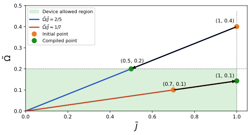

# Adimensionalization

This section explains how QoolQit's dimensionless formulation relates to physical quantities, and how compilation maps abstract programs back to real hardware.

---

## Physical Hamiltonian

In physical units, the Rydberg Hamiltonian is:

$$
H(t) = \underbrace{\sum_{i<j} \frac{C_6}{r_{ij}^{6}} \hat{n}_i \hat{n}_j}_{\text{interactions}}
+ \underbrace{\sum_i \frac{\Omega(t)}{2}\left(\cos\phi(t)\,\hat{\sigma}_i^x - \sin\phi(t)\,\hat{\sigma}_i^y\right)}_{\text{global drive}}
- \underbrace{\sum_i \left(\delta(t) + \epsilon_i\Delta(t)\right)\hat{n}_i}_{\text{detuning}}
$$

where $\hat{n}=\frac{1}{2}\left(1+\hat{\sigma}^z\right)$ is the Rydberg occupation operator.

| Symbol | Description | Typical units |
|--------|-------------|---------------|
| $C_6(n)$ | Interaction coefficient (Rydberg level $n$) | $\text{rad/s} \times \mu\text{m}^6$ |
| $\Omega(t)$ | Global Rabi frequency (drive amplitude) | rad/s |
| $\delta(t)$ | Global detuning | rad/s |
| $\Delta(t)$ | Local detuning amplitude | rad/s |
| $\phi(t)$ | Drive phase | $[0, 2\pi)$ |
| $\epsilon_i$ | Local detuning weight | $[0, 1]$ |

---

## Introducing the Reference Interaction $J_0$

To make programs device-agnostic, QoolQit defines an arbitrary reference distance $r_0$ and a corresponding reference interaction:

$$
J_0 = \frac{C_6}{r_0^6}
$$

This $J_0$ sets the energy scale for the problem. All quantities are then expressed relative to it:

$$
\tilde{r}_{ij} = \frac{r_{ij}}{r_0}, \qquad \tilde{J}_{ij} = \frac{1}{\tilde{r}_{ij}^6}, \qquad \tilde{\Omega} = \frac{\Omega}{J_0}, \qquad \tilde{\delta} = \frac{\delta}{J_0}
$$

Dividing the full Hamiltonian by $J_0$ yields the dimensionless QoolQit Hamiltonian:

$$
\tilde{H}(t) = \sum_{i<j} \tilde{J}_{ij}\,\hat{n}_i \hat{n}_j
+ \sum_i \frac{\tilde{\Omega}(t)}{2}\left(\cos\phi(t)\,\hat{\sigma}^x_i - \sin\phi(t)\,\hat{\sigma}^y_i\right)
- \sum_i \left(\tilde{\delta}(t) + \epsilon_i\tilde{\Delta}(t)\right)\hat{n}_i
$$

!!! note "Key convention"
    In QoolQit, the minimum dimensionless distance is fixed such that $\min(\tilde{r}_{ij}) = 1$, which means the maximum interaction strength is also 1.

---

## Compilation

When you write a QoolQit program, you specify dimensionless ratios like $\tilde{\Omega}/\tilde{J}$. Compilation chooses a concrete value for $J_0$ that maps these ratios to physical values within a given device's capabilities.

The key insight is:

- A **program** defines a ratio $\tilde{\Omega}/\tilde{J}$, which corresponds to a line through the origin in $(\Omega, J)$ space.
- A **device** defines a box of allowed physical values: $[0,\,\Omega_{\max}] \times [0,\,J_{\max}]$.

All points on the program line that fall within the device box are valid compilations. Choosing $J_0$ is equivalent to selecting which point on that line to use. In practice, programs running at higher amplitude perform better on hardware, so QoolQit automatically selects the point that maximises amplitude while staying within device constraints.

### Case 1: Drive-limited compilation

When the program line hits the maximum amplitude $\Omega_{\max}$ before reaching $J_{\max}$, the compiler sets:

$$J_0 = \Omega_{\max}$$

and calculates the corresponding reference distance, which will fit within device specs.

### Case 2: Interaction-limited compilation

When the program line hits the maximum interaction $J_{\max}$ before reaching $\Omega_{\max}$, the compiler sets:

$$J_0 = J_{\max}$$

This is equivalent to placing the closest pair of atoms at the minimum allowed distance. The compiler then derives the corresponding $\Omega$ value.

!!! note
    This strategy guarantees that compiled programs fit within device specs (if compilation succeeds) and use the maximum amplitude possible for the user-defined program.

If compilation fails, the program simply cannot fit the device under any valid assignment of $J_0$.

---

## Future Extensions

- QoolQit may suggest approximations of incompatible programs that would otherwise fail to compile.
- A "force compilation" strategy is planned for future versions.
