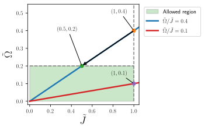

In this page, you will learn:

- What the compilation step does and why it's important
- How dimensionless units work in QoolQit
- Compilation strategies: default and working point (in progress)
- Hardware modulation and noise

## Compiling a quantum program

QoolQit programs are written using dimensionless units, making them hardware-independent.
Qubit positions use dimensionless coordinates, waveforms have dimensionless amplitudes and detunings, and time is measured in units of a reference interaction energy called $J_{max}^{d}$.
This device-agnostic approach allows the same program to be compiled and executed on any compatible quantum hardware.

Compilation transforms these dimensionless quantities into concrete physical values and translates the QoolQit program into low-level instructions for real quantum processing units (QPUs). The compilation process:

1. Converts all dimensionless times, energies, and distances into their physical equivalents.
2. Rescales the program to satisfy device-specific hardware constraints.
3. Generates a Pulser `Sequence` containing the low-level instructions for QPU execution.

The conversion rules ensure that the dimensionless Hamiltonian $\tilde{H}(\tilde{t})$ and the physical Hamiltonian $H(t)$ produce identical unitary evolution.
For a complete mathematical derivation, see the [Adimensionalization and Compilation](../../extended_usage/adimensionalization.md) page.

The essential conversion relationships are:

$$
r_{ij} = \left(\frac{C_6}{J_{max}^{d}}\right)^{1/6}	\tilde{r}_{ij},
\qquad
\Omega(t) = J_{max}^{d}\,	\tilde{\Omega}(	\tilde{t}),
\qquad
\delta(t) = J_{max}^{d}\,	\tilde{\delta}(	\tilde{t}),
\qquad
t = \frac{	\tilde{t}}{J_{max}^{d}}.
$$

Setting $J_{max}^{d}$ determines the physical amplitude scale, detuning scale, runtime, and atom spacings all at once.

The compilation output is stored internally as a Pulser `Sequence`, which contains the instructions for QPU execution.
Pulser is an open-source library that provides tools for designing and running pulse sequences on programmable neutral atom arrays.
For more details about Pulser's scope and capabilities, visit [Pasqal's documentation portal](https://docs.pasqal.com/pulser/).

### Default compilation

A device imposes hardware constraints on the compiled program. The two most important ones for
compilation are:

- a **maximum drive amplitude** $\Omega_{\max}$, which defines $J_{max}^{d}$ through
  the relation $J_{max}^{d} = \Omega / 	\tilde{\Omega} \le \Omega_{\max} / 	\tilde{\Omega}_{\max}$;
- a **minimum atom spacing** $r_{\min}$, which defines $J_{max}^{d}$ through the distance
  relation $r_{ij} = (C_6/J_{max}^{d})^{1/6}	\tilde{r}_{ij} \ge r_{\min}$, i.e.
  $J_{max}^{d} \le C_6 / (r_{\min}/	\tilde{r}_{\min})^6$.

QoolQit always picks the **largest energy scale consistent with these hardware constraints**, because a
larger reference scale realizes the same dimensionless program with a higher physical amplitude and a
shorter physical runtime — the most efficient use of the hardware.

The determining factor is which constraint becomes active first, based on comparing the dimensionless program ratio,

$$
\frac{\tilde{\Omega}_{\max}}{\tilde{J}_{\max}} = \tilde{\Omega}_{\max} \cdot \tilde{r}_{\min}^6,
$$

which characterizes the program, compared with the corresponding device ratio

$$
\frac{\Omega_{\max}}{J_{\max}} = \frac{\Omega_{\max} \cdot r_{\min}^6}{C_6}.
$$

The following figure illustrates both scenarios:

The users works by default at $\tilde{J}=1.0$. When the program's energy ratio exceeds the device's energy ratio, the drive amplitude bound is reached first (blue line). The largest valid $J_0$ is then obtained by **rescaling the amplitude limit** to the maximum allowed value (as denoted by the arrow).

In this regime the compiled program runs at **maximum device amplitude**, and the physical atom spacings are larger than the device minimum.

When the program's energy ratio is within the device budget, the minimum-spacing constraint is reached first (red line). The largest valid $J_0$ is obtained by **saturating the distance limit**.

In this regime the compiled register uses the smallest physical spacing the device allows, and the resulting amplitude is below $\Omega_{\max}$.

!!! note "QoolQit always maximizes the physical energy scale"
    In both cases, QoolQit selects the largest feasible reference scale $J_0$. Doing so
    gives the fastest possible physical runtime for the program, since $t = \tilde{t}/J_0$
    decreases as $J_0$ increases.

#### Example

As mentioned above, compilation does **not** change the physics of the program.
Instead, it rescales the program so that it lies inside the region that can be implemented on a given device.

Consider the figure below:

The green box highlights the valid parameter region for the interaction energy $\tilde{J}_{ij}$ and the driving amplitude $\tilde{\Omega}$.
As described in the [QoolQit model](../../get_started/qoolqit_model.md) page, the interaction energy is bounded by 1 by construction: QoolQit's adimensionalization enforces $\tilde{J}{ij} = J_{ij}/J_{max}^{d} \leq 1$ across all devices.
The driving amplitude (more precisely, its maximum over time) is instead constrained to a device-dependent upper bound, $\tilde{\Omega} = \Omega/J_{max}^{d} \lesssim \Omega_{max}^{d}/J_{max}^{d} = 0.2$.

The key idea is that the program is defined by **ratios**, not by absolute scales. For example, fixing the ratio $\frac{\max_{\tilde{t}}\tilde{\Omega}}{\tilde{J}}$ defines a line in the $(\tilde{J},\tilde{\Omega})$ plane. Moving along this line changes the overall scale of the program, but preserves its dimensionless structure (here $\max_{\tilde{t}}$ stands for the maximum over time).

We define two programs by specifying the maximum amplitude in time $\max_{\tilde{t}}\tilde{\Omega}$ and the interaction between nearest neighbor atoms in the register $\tilde{J}=\frac{1}{\tilde{a^6}}$. We define the following tuples:

1. $(\tilde{J},\max_{\tilde{t}}\tilde{\Omega}) = (1,0.4)$,
2. $(\tilde{J},\max_{\tilde{t}}\tilde{\Omega}) = (0.7,0.1)$

The lines correspond to the programs with fixed ratio $\tilde{\Omega}/\tilde{J}=2/5$ and $\tilde{\Omega}/\tilde{J}=1/7$.
At compilation QoolQit checks the energy ratio and the valid region of compilation and maximizes the $\tilde{\Omega}$.

1. The point $(1,0.4)$ is outside the valid region, because the drive amplitude is too large. To compile the program, QoolQit rescales it while preserving the ratio $\max_{\tilde{t}}\tilde{\Omega}/\tilde{J} = 2/5$.
2. The point $(0.7,0.1)$ is inside, but the drive amplitude can be larger. QoolQit rescales it to the maximum possible $\tilde{\Omega}$ while preserving the ratio $\max_{\tilde{t}}\tilde{\Omega}/\tilde{J} = 1/7$.

The dimensionless content is unchanged: the ratio between drive and interaction is the same, and therefore the underlying dimensionless problem is the same.

#### What changes under compilation?

What is preserved by compilation is the ratio $\max_{\tilde t}\tilde\Omega/\tilde J$ — that is, the relative balance between drive and interactions, which defines the line on which the program lives and encodes the physics of the problem.

What changes are the **dimensionless values themselves**: compilation slides the program along its line, multiplying $\tilde J$, $\tilde\Omega$, and $\tilde\delta$ by a common factor $\alpha$ chosen as large as possible while keeping the program inside the device's feasible region.

For instance, compiling the program $(\tilde J, \max_{\tilde t}\tilde\Omega) = (1, 0.4)$ to $(0.5, 0.2)$ corresponds to a rescaling factor $\alpha = 0.5$. The ratio $2/5$ is preserved, but the dimensionless interaction is halved, meaning the closest pair of atoms is placed further apart and the dimensionless drive is halved so that it saturates the device maximum.

Finally, compilation also rescales time: if the dimensionless Hamiltonian is multiplied by $\alpha$, dimensionless time must be divided by $\alpha$ in order to preserve the unitary evolution. A full derivation and concrete numerical examples are given in [Adimensionalization and Compilation](../../extended_usage/adimensionalization.md).

### Working point compilation
In progress...

## Hardware effects

Real quantum hardware introduces deviations between the ideal compiled program and its actual execution. These effects can be categorized into two main classes: hardware modulation and noise sources.

Importantly, in both cases, these effects can be included by configuring emulators, as detailed in the [Execution](../execution/execution.ipynb) page of this documentation.

### Hardware modulation
**Hardware modulation** arises from the finite bandwidth limitations of optical channels, such as the lasers that drive qubits in neutral atom QPUs. When waveforms contain sharp features (like steps or rapid transitions) the hardware's bandwidth constraints will smooth out these abrupt changes during actual laser pulse execution. This smoothing can alter the intended pulse shape and timing, potentially affecting the quantum operation's fidelity.
The net effect on the drive is always visible when inspecting the compiled sequence in a program, as shown in [Devices and Compilation](./device_and_compilation.ipynb). Moreover, to account for hardware modulation during the emulation of a program, emulators must be configured with the flag `with_hardware_modulation=true`, as described in [Execution](../execution/execution.ipynb).

### Noise
**Noise sources** encompass various forms of environmental and systematic errors that introduce unwanted fluctuations or systematic shifts in the quantum system parameters during execution.
As before, to include noise sources in the emulation of a program, emulators must be configured with the flag `noise_model`, as described in [Execution](../execution/execution.ipynb).

Finally, for more detailed information on [hardware modulation](https://docs.pasqal.com/pulser/tutorials/output_mod_eom/) and [noise sources](https://docs.pasqal.com/pulser/noise_model/), consult the comprehensive discussions available in the Pulser documentation.
