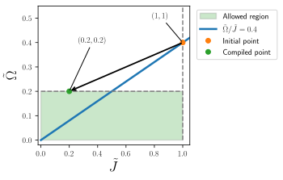

# Introduction

QoolQit lets you write analog quantum programs for neutral-atom platforms in a **dimensionless framework**. Instead of working directly with physical units, you express your program in terms of ratios and relative scales. The same program can then be compiled to any compatible device.

This solves a key challenge in programming neutral-atom quantum computers: in standard hardware-level descriptions, one must specify physical parameters such as atom positions in micrometers, laser amplitudes in MHz, and pulse durations in nanoseconds. These values depend strongly on the particular hardware platform, since different devices have different Rydberg levels, laser power limits, and trapping geometries.

QoolQit introduces a **dimensionless reference frame** with the following conventions:

- Distances are rescaled so that the smallest pairwise distance equals $1$. This also implies that the largest interaction strength is normalized to $1$.
- $\tilde{\Omega}(t)$ and $\tilde{\delta}(t)$ are measured relative to the maximum interaction strength, which is equal to $1$ in the dimensionless program.
- Times $\tilde{t}$ are measured relative to the interaction timescale.

This means that programs are **hardware-independent until compilation**: drive strengths are naturally expressed as multiples of the interaction strength, and the same program can be compiled to different devices without modification.

Once a quantum program is written, a **compilation routine** automatically maps its dimensionless parameters to physical values compatible with the target hardware.

---

## The QoolQit Dimensionless Hamiltonian

In QoolQit the system is described by the following Hamiltonian:

$$
\tilde{H}(t) =
\underbrace{\sum_{i<j} \tilde{J}_{ij}\,\hat{n}_i \hat{n}_j}_{\text{interactions}}
+
\underbrace{\sum_i \frac{\tilde{\Omega}(t)}{2}
\left(
\cos\phi(t)\,\hat{\sigma}^x_i - \sin\phi(t)\,\hat{\sigma}^y_i
\right)}_{\text{global drive}}
-
\underbrace{\sum_i \left( \tilde{\delta}(t) + \epsilon_i\,\tilde{\Delta}(t) \right) \hat{n}_i}_{\text{detuning}}.
$$

Here, $\hat{n}_i = \frac{1}{2}(1 + \hat{\sigma}^z_i)$ is the Rydberg occupation operator of atom $i$, and the $\hat{\sigma}^{x,y,z}_i$ are the Pauli operators:
$$
\sigma^x=\begin{pmatrix} 0 & 1\\ 1 & 0\end{pmatrix},
\qquad
\sigma^y=\begin{pmatrix} 0 & -i\\ i & 0\end{pmatrix},
\qquad
\sigma^z=\begin{pmatrix} 1 & 0\\ 0 & -1\end{pmatrix}.
$$

The interaction follow the $1/r^6$ Rydberg scaling, normalized so that the maximum equals $1$: $\tilde{J}_{ij} = \tilde{r}_{ij}^{-6}$ and $\max(\tilde{J}_{ij}) = 1$.

More details about the connection to physical units are provided in the section [Adimensionalization](../extended_usage/adimensionalization.md).

The following table summarizes the parameters appearing in the Hamiltonian and their allowed ranges.

| Symbol | Description | Range |
|--------|-------------|-------|
| $\tilde{J}_{ij}$ | Dimensionless coupling between sites $i$ and $j$ | $(0,\,1]$ |
| $\tilde{\Omega}(t)$ | Global drive amplitude, affecting all sites equally | $\geq 0$ |
| $\tilde{\delta}(t)$ | Global detuning, affecting all sites equally | any real value |
| $\tilde{\Delta}(t)$ | Local detuning amplitude | $\leq 0$ |
| $\phi(t)$ | Global phase | $[0,\,2\pi)$ |
| $\epsilon_i$ | Local detuning weight for site $i$ | $[0,\,1]$ |
| $\tilde{t}$ | Dimensionless time | $> 0$ |

### Drive regimes

Because $\tilde{\Omega}$ is expressed relative to the maximum interaction strength, strong and weak drive regimes are defined independently of the specific geometry:

| Regime | Condition | Intuition |
|--------|-----------|-----------|
| Strong drive | $\tilde{\Omega} \gg 1$ | Controls dominate; interactions are a perturbation |
| Balanced | $\tilde{\Omega} \sim 1$ | Controls and interactions compete |
| Weak drive | $\tilde{\Omega} \ll 1$ | Interactions dominate; blockade and correlation effects are strong |

### Time regimes

Time is expressed in QoolQit in units of the maximum interaction energy.

In an interacting many-body system, this gives $\tilde{t}$ a natural physical interpretation: it measures evolution time relative to the timescale on which interactions generate correlations. Roughly speaking, a time $\tilde{t} \sim 1$ is enough for nearest-neighbor sites to begin developing correlations. More generally, $\tilde{t} \sim n$ can be interpreted as the timescale on which correlations may have propagated over a distance of order $n$ lattice spacings.

This makes dimensionless time a convenient, geometry-independent way to describe how long the system evolves relative to its intrinsic interaction dynamics.

| Regime | Condition | Intuition |
|--------|-----------|-----------|
| Short time | $\tilde{t} \ll 1$ | Evolution is too brief for interactions to significantly build up correlations |
| Intermediate time | $\tilde{t} \sim 1$ | Interactions begin to visibly affect the dynamics; nearest-neighbor correlations can emerge |
| Long time | $\tilde{t} \gg 1$ | Correlations and many-body interaction effects have had time to spread across the system |

---

## Compilation
As described above, a QoolQit program is written in **dimensionless units**. This means that the user specifies the problem in terms of dimensionless quantities, independently of any particular device.

However, the values that can actually be implemented are constrained by the **hardware**. Real devices only allow certain ranges of interaction strengths, drive amplitudes, detunings, and evolution times. Therefore, an important task of QoolQit is to take the dimensionless program specified by the user and map it to a set of parameters that can be realized on the chosen hardware. We refer to this step as **compilation**.

!!! Compilation
    Compilation is the step where QoolQit takes a dimensionless program and rescales it into hardware-realizable parameters, while preserving its dimensionless structure.

A convenient way to understand this is to first work entirely in dimensionless units.

The key idea is that the program is defined by **ratios**, not by absolute scales. For example, fixing the ratio $\max_{\tilde{t}}\frac{\tilde{\Omega}}{\tilde{J}}$ defines a line in the $(\tilde{J},\tilde{\Omega})$ plane. Moving along this line changes the overall scale of the program, but preserves its dimensionless structure
(here $\max_{\tilde{t}}$ stands for the maximum over time).

This means that compilation does **not** change the dimensionless physics of the program. Instead, it rescales the program so that it lies inside the region that can be implemented on a given device.

### Example

Consider a program defined by $(\tilde{J},\max_{\tilde{t}}\tilde{\Omega}) = (1,0.4),$ so that $\frac{\max_{\tilde{t}}\tilde{\Omega}}{\tilde{J}} = 0.4$.

Now assume that the valid compilation region is constrained by $\tilde{J} \leq 1, \;\tilde{\Omega} \leq 0.2,$ as shown in the figure below.

In this figure, the green rectangle represents the valid compilation region. The diagonal line corresponds to all programs with fixed ratio $\tilde{\Omega}/\tilde{J}=0.4$. The point $(1,0.4)$ is outside the valid region, because the drive amplitude is too large. To compile the program, QoolQit rescales it while preserving the ratio $\max_{\tilde{t}}\tilde{\Omega}/\tilde{J} = 0.4$.

The largest valid point on this line is $(\tilde{J},\tilde{\Omega}) = (0.5,0.2).$ So the program is rescaled by a factor $0.5$, but its dimensionless content is unchanged: the ratio between drive and interaction is the same, and therefore the underlying dimensionless problem is the same.

### What changes under compilation?

What remains fixed is the **dimensionless program**. What changes is the **reference scale** used to map it to a physical device. A full derivation of the mapping and concrete numerical examples are given in [Adimensionalization](../extended_usage/adimensionalization.md).

If the initial point $(1,0.4)$ corresponds to choosing the maximum interaction strength as the reference scale, then compiling to $(0.5,0.2)$ means that the program is realized with a smaller reference interaction, equal to $0.5$ times the original one. It is important to keep in mind that compilation also rescales time.

In other words, compilation keeps the dimensionless problem unchanged, but changes the conversion between dimensionless quantities and physical ones.
